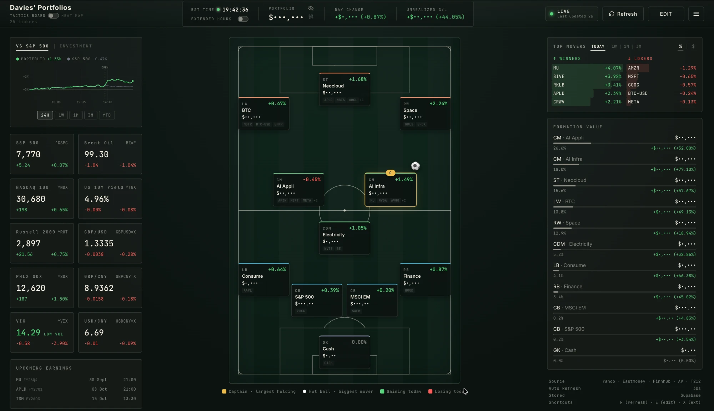
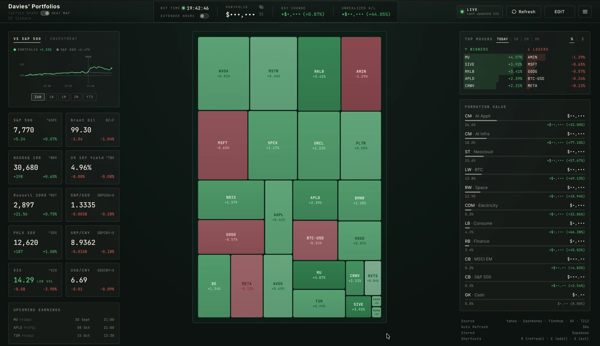
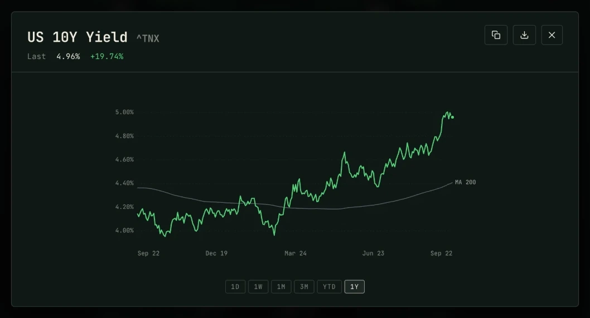
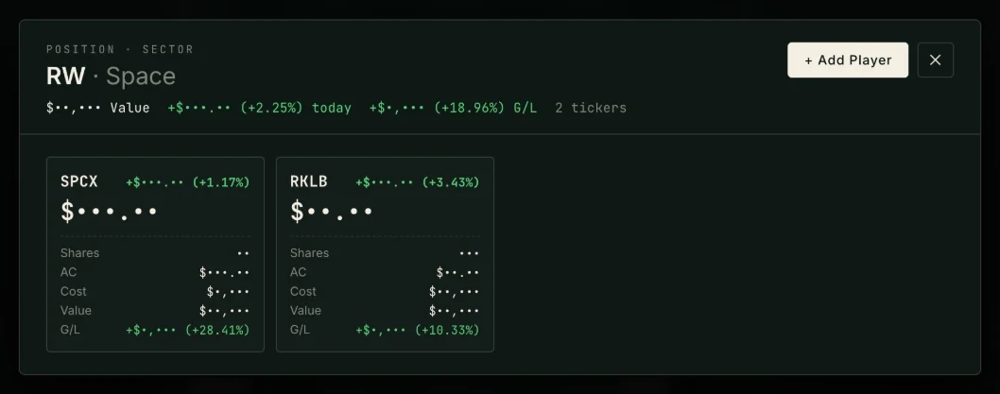
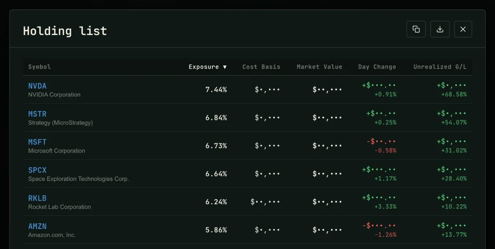
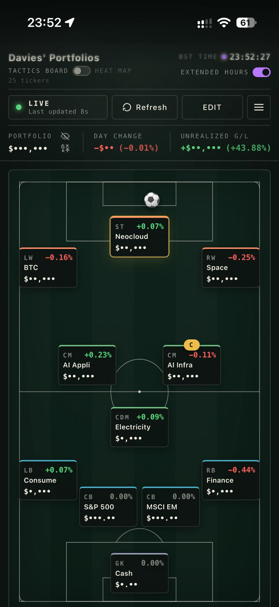
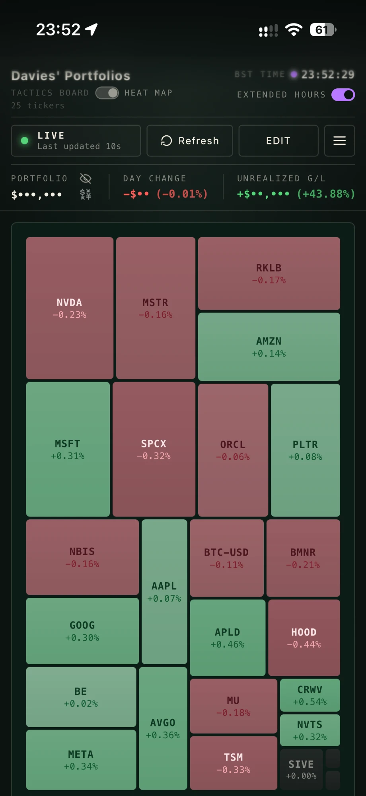
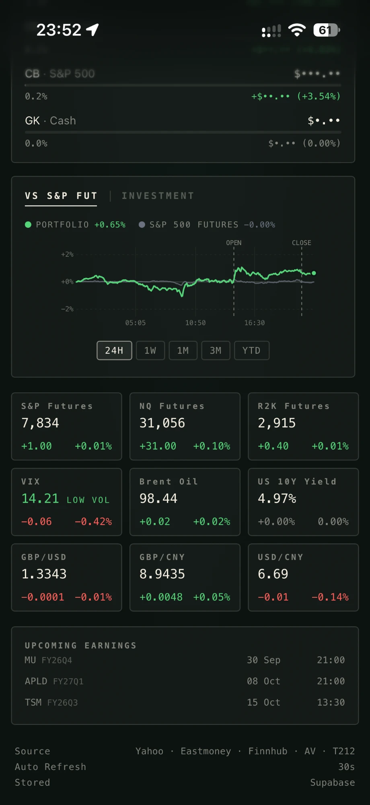

# Davies' Portfolios

[](https://github.com/daviesluo/daviesportfolios/actions/workflows/check.yml)
[](https://github.com/daviesluo/daviesportfolios/actions/workflows/edge-functions.yml)
[](../LICENSE)

I built this dashboard to run my own portfolio, and I use it every day.
It lays the book out as a football tactics board: each sector is a
player on the pitch. Around the board are a heat map, performance
against the S&P 500, market conditions, charts with valuation history, a
transaction ledger synced from my broker, and a crypto trading loop that
has to prove itself on paper before it touches real money.

> **Live example: [daviesluo.com](https://daviesluo.com)**
>
> This is my own instance with my real portfolio, so it needs a
> password. **Contact me, Davies, for one.**
>
> In the screenshots below every amount and share count is hidden by the
> site's hide-values switch (the eye icon next to PORTFOLIO). I built it
> so I can show the page without showing the money. Percentages, tickers
> and market data are real.

## Screenshots

Desktop and phone, 22 September 2026, amounts hidden.

**Tactics board.** Each card is a sector with its holdings, value and
today's move. The armband marks the largest single holding and the ball
sits by the day's biggest mover. Performance, market conditions and
upcoming earnings are on the left; top movers and sector weights on the
right.



| Heat map | Market chart |
|---|---|
|  |  |

- **Heat map**: one tile per holding, sized by value, coloured by today's
  move.
- **Market chart**: every card opens a chart from 1D to 1Y, with moving
  averages, VWAP, and P/E or P/S history for stocks. This one is the US
  10-year yield with its 200-day average.

| Sector drill-down | Holding list |
|---|---|
|  |  |

- **Sector drill-down**: a sector's holdings with shares, average cost,
  value and gain.
- **Holding list**: every holding, sortable, with copy and Excel export.

On a phone the page is one column: the board or the heat map first, then
the sidebar with performance, market conditions and upcoming earnings.

| Tactics board | Heat map | Sidebar |
|---|---|---|
|  |  |  |

Screenshots of the Agents page will follow once a strategy is live.

## What it does

- **Tactics board**, the default view. Cash is in goal, index funds play
  centre-back and the thematic bets play further forward. In edit mode
  you drag one card onto another to swap two sectors.
- **Heat map** of every holding.
- **Performance vs the S&P 500** over 24H, 1W, 1M, 3M and YTD, both lines
  starting at 0 %. The **Investment** tab shows the book's value against
  the money paid in. Prices are recorded on the server every five
  minutes, and any stretch that had to be rebuilt is drawn faded.
- **Market conditions**: the major US indices, VIX, the 10-year yield,
  Brent and three FX pairs. An extended-hours switch moves the indices to
  their futures.
- **Charts** for every holding and market card, including a real
  overnight line for US stocks built from recorded broker quotes. Any
  chart can be copied or saved as an image.
- **The ledger**: buy lots and sales per holding, cost basis and realised
  gain across USD, GBP, EUR, CNY and HKD with live FX, and Chinese mutual
  funds priced from Eastmoney.
- **Trading 212 sync** of positions and every fill, without touching
  shares of the same ticker held at another broker.
- **Two passwords**: one that can edit and a read-only one for sharing,
  both checked on the server.
- **Installs as an app** on iOS and Android, works offline, and tells you
  when a new version is out.

## How it's built

![Architecture. The user opens daviesluo.com and signs in once with a
password, which the auth function exchanges for a signed token. The
browser, a React 19 PWA served by Cloudflare Pages, paints from its own
cache first and then sends requests carrying that token to Supabase Edge
Functions written in Deno: auth, data, prices, chart, fundamentals,
trading212, overnight-fetch, ops-error and agents. Separately, pg_cron
calls scheduled Edge Functions with no browser open: snapshot-record
every five minutes, overnight-record every five minutes through the US
overnight session, and the agents trading loop every minute, paper first.
Both kinds of function read and write Postgres, which keeps the
portfolio, five-minute prices, overnight quotes, broker fills, error
reports and every agents decision, order and fill. Outside services —
Yahoo Finance, Eastmoney, Finnhub, Alpha Vantage, Trading 212, Revolut X,
Kraken and the TypeSafe Jev decision model — are called from the server,
where every key stays.](architecture.svg)

The page and the scheduled jobs share one database, so prices keep being
recorded when nobody has the page open.

| Layer | What I used |
|---|---|
| Client | React 19 and Vite. Plain JSX, type-checked by `tsc`. Four runtime dependencies. Charts are hand-written SVG. |
| Server | Supabase Edge Functions on Deno. Every key lives here; the browser only holds a short-lived signed token. |
| Data | Postgres. CI applies the migrations. |
| Scheduling | `pg_cron` calls the recorders through `pg_net`. |
| Hosting | Cloudflare Pages serves the built bundle. |
| CI/CD | GitHub Actions: gates on every push, Edge Functions deployed when they change, migrations applied when they reach `main`, a health check every 10 minutes. |

## How I work on it

- **Every push runs the same gates**: type-check, lint, unit tests, a
  production build, two browser tests, a bundle-size budget, a dead-code
  scan and a dependency audit. `bin/gates.sh` runs them all locally.
- **Three levels of tests**: over 900 unit tests (Vitest), about 390 Edge
  Function tests (Deno), and two browser runs against the real production
  bundle in Chromium: 208 checks across the whole page at desktop and
  phone widths, and 60 cases of the performance panel checked against
  answers worked out by hand.
- **Every bug fix comes with a test that fails on the old code.** When it
  matters I revert the fix and watch the test fail again.
- **Numbers are checked against arithmetic, not against the app.** Test
  data is built so the right answer can be worked out by hand.
- **One function per number.** The performance chart, the investment
  chart and top movers all use the same valuation code. Two separate
  versions of it once drifted apart and put two different numbers on
  one screen.
- **Errors are recorded.** Client and server errors go into a table, and
  an admin badge in the header groups the last 24 hours.

## The crypto trading loop

A trading loop for BTC, ETH, SOL, AVAX and SUI. Revolut X executes;
Kraken's candles are the signal. Every minute it quotes both venues,
manages open orders and checks a stop against the live bid. On each new
closed bar it asks its rulebook what to do.

- **The rules decide, and the model can only say no.** Entries and exits
  come from written rules: trend following on 4-hour and 1-hour bars,
  and 30-day momentum. The TypeSafe Jev decision model is asked about
  entries only and can refuse one. A risk gate with its limits in the
  database has the last word.
- **Backtests use the loop's own fills, fees and stops**, on four
  separate market years that are never averaged.
- **Every result is checked against chance.** Test enough coins and
  rules and some win by luck, so each study says how many passes luck
  alone would give.
- **What didn't work is written down with numbers**: anything faster
  than 1-hour bars (fees eat it), arbitrage between the two exchanges
  (the gap never covers the fee), and real money on Kraken (its fees).
- **Paper first.** All three strategies are paper today. A live order
  needs the row switched to live, a confirmation in the database, the
  risk gate's approval and my go-ahead.

The evidence is in [`docs/agents/reference.md`](agents/reference.md),
the case for the first live strategy in
[`docs/agents/go-live.md`](agents/go-live.md).

## Repository map

| Path | What's there |
|---|---|
| `src/` | The web app, an npm project of its own: the React client (the board, charts, panels, ledger tables and the Agents page) with its tests beside each file, the browser tests in `src/e2e/`, and its settings (`package.json`, Vite, ESLint, TypeScript). |
| `src/public/` | Static files copied into the build: Cloudflare's `_headers` and `robots.txt`. |
| `supabase/functions/` | The Edge Functions: `auth`, `data`, `prices`, `chart`, `fundamentals`, `trading212`, `overnight-fetch`, `overnight-record`, `snapshot-record`, `ops-error` and `agents`, plus `_shared/`. Each has its tests beside it. |
| `supabase/migrations/` | The database schema, applied by CI in order. |
| `dist/` | The built site. Committed, and served as it is by Cloudflare Pages. |
| `bin/` | `setup.sh` for a new clone, `gates.sh` for every check CI runs, `knip-edge.sh` for the Edge Functions' dead-code check, and the ledger's commit hook. |
| `docs/` | The user guide, the full system map, the agents research, screenshots and the diagram. |
| `.github/` | CI workflows, the security policy and the PR template. |
| `docs/LEDGER.md` | The running work log: what's in flight and what happened, newest first. |
| `.claude/`, `.cursor/`, `.agents/` | Instructions for the AI coding agents I work with, kept in one file (`.claude/CLAUDE.md`), and the ledger protocol they all follow. |

The file-by-file map, the engineering notes behind each decision and the
data flow are in [`docs/map.md`](map.md). How to use every part of
the board is in [`docs/guide.md`](guide.md).

## Run it locally

```sh
sh bin/setup.sh          # the ledger hook, and npm ci in src/
sh bin/gates.sh          # everything CI checks
cd src && npm run dev    # http://localhost:5173
```

The client talks to the production Supabase project, so the board needs
one of the two passwords. To run your own copy, see "Forking" in
[`docs/map.md`](map.md).

## License

MIT, see [LICENSE](../LICENSE).
